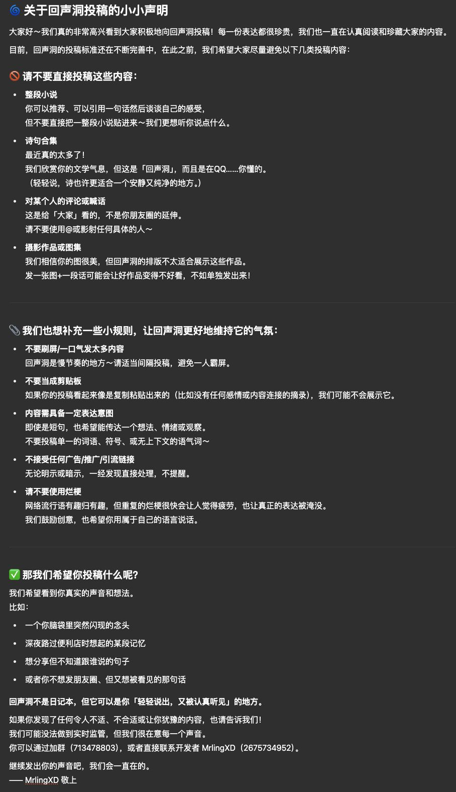

# 回声洞

看看别人的投稿，也可以自己投稿~

## 服务信息

- **服务名**：回声洞
- **说明**：查看别人投稿的回声洞，也可以自己投稿

## 命令列表

### 回声洞 `[编号]`

> 别名：`cave`

随机抽一条别人投稿的回声洞；带上编号则查看指定的那一条。展示内容、投稿人（匿名投稿显示「不愿透露姓名的TA」）和投稿时间。

### 投稿 `<内容>`

> 仅限**私聊**

把你想说的话投进回声洞，让大家都能看到。支持文字、图片等内容。

### 匿名投稿 `<内容>`

> 仅限**私聊**

和投稿一样，但不会显示你的身份——害羞，但就是想发表心里话 awa。

### 回声洞记录

> 别名：`回声洞记录`

查看你自己的全部投稿记录（以合并转发形式发出）。

### 删除 `<编号> [原因]`

> 别名：`删除回声洞`

删除指定编号的回声洞。

- 你只能删**自己**的投稿
- 管理员可以删任何人的投稿，删除时会**私信通知**作者，并附带删除原因（不填则为「管理员删除」）

::: warning 平台限制
投稿 / 匿名投稿 / 删除 / 回声洞记录暂不支持 QQ 官方机器人平台。
:::

## 2025年6月25日的声明

