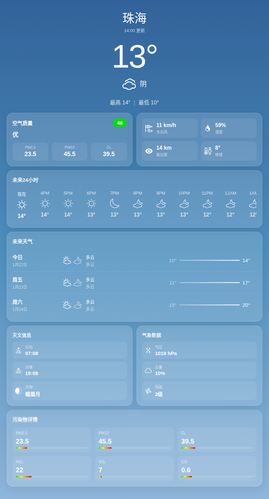

# 天气

偷着乐吧，你看你的朋友都没带伞，就你带了，快谢谢姚奕（

## 服务信息

- **服务名**：天气
- **说明**：来看看今天的天气吧！

## 命令列表

### 天气 `<地名>`

查询对应地区的天气，渲染成一张图片返回。一张图里包含：

- **实时天气**：温度、天气状况等
- **逐时 / 逐日预报**
- **空气质量**：AQI 指数与主要污染物
- **气象预警**（如有）

图片会根据当前时间自动切换**白天 / 夜间**主题。找不到城市时会提示你换个地名再试。

## 效果展示

